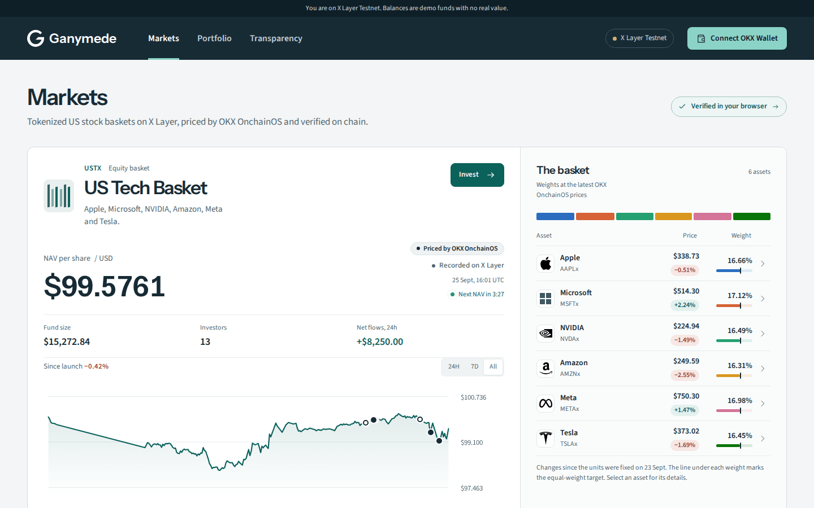
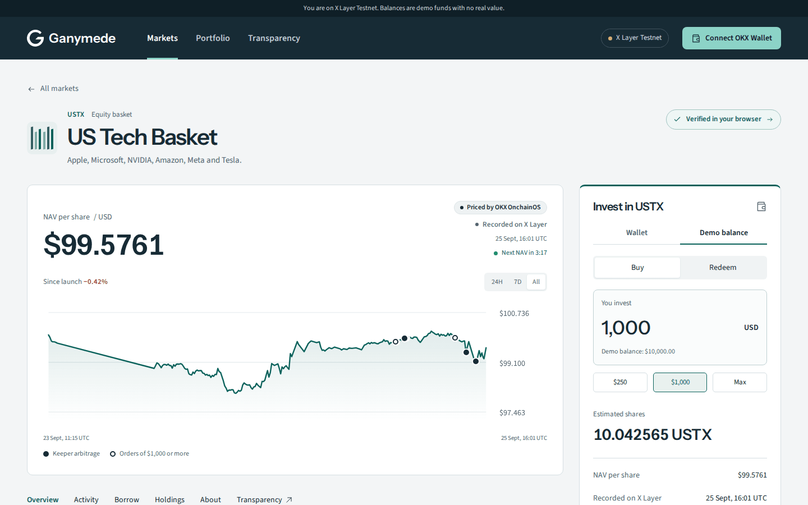
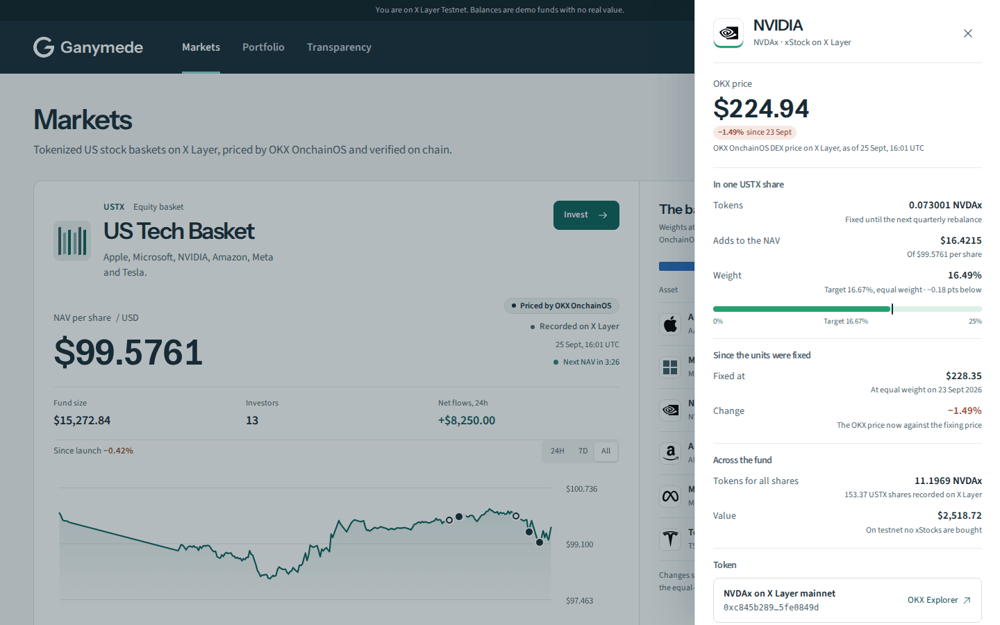
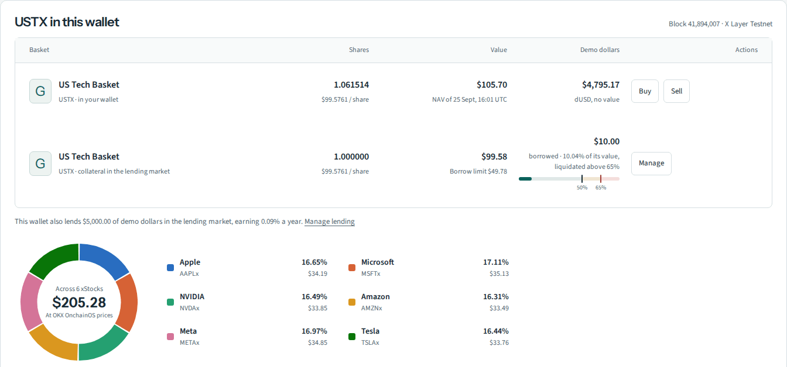
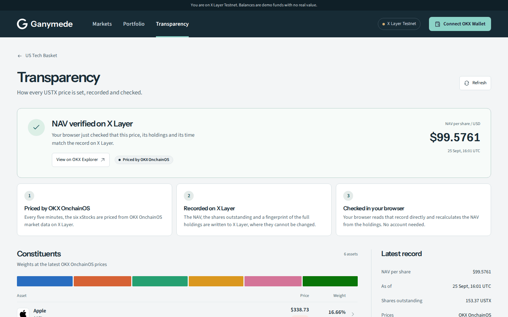

# Ganymede — a tokenized-stock fund you can verify yourself

Ganymede sells **USTX, the US Tech Basket**: one share holds Apple, Microsoft, NVIDIA, Amazon, Meta and Tesla through their xStocks on X Layer. You invest from OKX Wallet on X Layer Testnet and receive USTX at the recorded NAV, see exactly which tokens your money put in the basket, and check every price yourself. Every five minutes Ganymede prices the xStocks through OKX OnchainOS, records the NAV, the shares outstanding and a SHA-256 fingerprint of the full composition on X Layer, and your browser reads that record directly and recalculates the NAV. The result can be downloaded as an evidence file and re-checked anywhere with one command.

[Markets](https://ganymede-xlayer.gana003.workers.dev/) · [USTX](https://ganymede-xlayer.gana003.workers.dev/products/ustx) · [Transparency](https://ganymede-xlayer.gana003.workers.dev/products/ustx/transparency) · [Portfolio](https://ganymede-xlayer.gana003.workers.dev/portfolio) · [For issuers](https://ganymede-xlayer.gana003.workers.dev/issuers) · [Docs & API](https://ganymede-xlayer.gana003.workers.dev/developers) · [Methodology](https://ganymede-xlayer.gana003.workers.dev/methodology) · [Risks](https://ganymede-xlayer.gana003.workers.dev/limitations)



Investing uses demo dollars with no value. From a wallet, the USTX contract on X Layer Testnet issues shares at the NAV recorded on X Layer; with a demo balance, nothing is issued on chain. No real money moves.

**Built for OKX Dev Day 2026 (Build a Market).** Ganymede existed before the event. The new work of the 17–25 September build period is listed with its commits in [docs/BUILD_PERIOD.md](docs/BUILD_PERIOD.md) and summarized below.

<table>
<tr>
<td width="50%"><br><sub>USTX: the NAV history with the keeper's arbitrage and orders of $1,000 or more marked, and the order panel.</sub></td>
<td width="50%"><br><sub>Each xStock: its OKX price, change since the units were fixed, weight against the target and token contract on X Layer mainnet.</sub></td>
</tr>
<tr>
<td width="50%"><br><sub>Portfolio: a wallet's USTX and its lending collateral, looked through to the six xStocks.</sub></td>
<td width="50%"><br><sub>Transparency: the visitor's browser checks the NAV against the record on X Layer.</sub></td>
</tr>
</table>

<sub>The production site on 25 September 2026: X Layer Testnet, demo funds with no value.</sub>

## Try it in two minutes

1. **Markets** shows USTX with its latest NAV and a countdown to the next five-minute record, fund size, investors, return since launch, the NAV history with the keeper's arbitrage and orders of $1,000 or more marked on it, and the weights of AAPLx, MSFTx, NVDAx, AMZNx, METAx and TSLAx. Select an xStock for its OKX price, its change since the units were fixed, its weight against the equal-weight target, the tokens in a share and in the whole fund, and its token contract on X Layer mainnet. A status chip reports the check your browser has just run against X Layer.
2. **Invest** on the USTX page. With OKX Wallet: connect, switch to X Layer Testnet, get 10,000 demo dollars (dUSD, no value), approve and invest. The `GanymedeBasketFund` contract reads the latest NAV from the registry and issues USTX to your wallet at that price; redeeming burns USTX and pays demo dollars at the same NAV. Without a wallet, the Demo balance tab gives every browser $10,000 in demo dollars and fills orders the same way, off chain. Either confirmation shows what went into your basket: the amount of each xStock token and its value.
3. **The fund overview** on the same page shows the fund size (shares outstanding × NAV, both recorded on X Layer), investors, return since the $100.00 launch on 23 September 2026, the key terms, 24-hour flows, the pool's price against the NAV on a gauge with the pool's 0.3% fee band, and what all shares hold of each xStock. The Borrow section marks a loan against its 50% borrow limit and 65% liquidation line.
4. **Portfolio** shows your demo account: total value, return, your USTX looked through to each xStock in a chart and a table, and your orders. Below it, connect OKX Wallet or paste any public address to see that wallet's USTX on X Layer Testnet and value its real xStock balances on X Layer mainnet at the verified prices, with a downloadable statement. The header's "Connect OKX Wallet" connects the same way. The wallet part is read-only; nothing is signed or sent.
5. **Transparency** is the customer proof page, in the manner of an exchange's proof of reserves. It shows the result of the check your browser runs automatically, how every price is made (priced by OKX OnchainOS, recorded on X Layer, checked in your browser), the holdings, the latest record, recent records with OKX Explorer links and what verification covers.
6. **Developers → Verify it yourself** shows the checks behind it. Your browser reads the pinned registry on X Layer Testnet, hashes the original document and recalculates every holding. Each check is shown with its result.
7. **Try to break it** on the developer page edits a copy of the document in your browser in three ways:
   - change one price: the row arithmetic and the fingerprint fail;
   - also fix the arithmetic: the NAV no longer matches the record;
   - offset two prices so every number and the NAV stay the same: only the fingerprint recorded on X Layer catches the change.
8. **Download evidence** on the developer page saves the document, the record and the publishing transaction. Anyone can re-check it:

```sh
npm ci
npm run verify:evidence -- ustx-evidence.json
```

The command repeats the fingerprint and arithmetic checks against the verifier's pinned deployment. It then reads the transaction receipt from X Layer and requires a matching `NavPublished` event, so a file still verifies after its record is no longer the latest. Add `--offline` to skip the chain read.

Nothing needs a sign-up. Wallet orders are transactions on X Layer Testnet; everything else needs no signature.

## For partners

- **Public NAV API.** `GET /api/v1/ustx` returns the latest record read from X Layer at request time: NAV, shares outstanding, fingerprint, transaction and verification links. No key, CORS open to every origin.
- **Market activity API.** `GET /api/v1/ustx/activity` returns the latest 40 market events (orders at the fund, pool trades, the keeper's arbitrage, loans) read from the contracts' logs on X Layer Testnet, with the block range they cover, the last 24 hours' figures, and highlights (every arbitrage and order of $1,000 or more) that the NAV chart marks.
- **Embeddable badge.** `/embed/ustx` is an iframe any site or wallet can show. It verifies the NAV in the visitor's own browser before it says "Verified".
- **Issuers.** [/issuers](https://ganymede-xlayer.gana003.workers.dev/issuers) explains how another tokenized-stock basket can launch on the same rails, with plans and a contact route. [/developers](https://ganymede-xlayer.gana003.workers.dev/developers) has the API, a viem example that reads the registry directly and the embed code.

## What was built during the event

| Area | New in the build period |
| --- | --- |
| X Layer | Settlement moved from the GIWA Sepolia testnet to X Layer Testnet. NAV registry, share ledger and relayer deployed; sources verified on the explorer. The USTX share token and demo dollars deployed on 25 September |
| Tokenized stocks | Six-xStock basket priced through OKX OnchainOS on X Layer mainnet. Publication gates reject missing, stale or mismatched quotes. NAV and fingerprint published every five minutes |
| Verification | Direct browser read and recalculation, a mainnet check of the six xStock contracts, the three-way tamper experiment, the evidence file and `verify:evidence` |
| Investing | Wallet investing on X Layer Testnet: the order panel quotes the USTX contract at the recorded NAV and the USTX/dUSD pool at its price after fee and price impact, routes each buy or sell to the better one (or the one the visitor picks), and OKX Wallet approves and sends it, with each step, the fill and the explorer link shown. Demo accounts with $10,000 in demo dollars, instant orders at the recorded NAV, idempotent retries and a daily order cap; a confirmation that shows the tokens each order put in the basket; a portfolio that looks through to every xStock |
| Fund | Fund overview with size, investors, return since launch and look-through holdings; the shares outstanding in wallets and demo balances recorded on X Layer with every NAV |
| Market activity | Markets shows the last 24 hours of the USTX market (volume, trades, keeper arbitrage and what it earned, loan actions) and the latest trades; the USTX page lists the market's latest events from X Layer Testnet: investments and redemptions at the NAV, pool trades with their price, the keeper's arbitrage as one row with what it earned, and every lending step, each linked to its transaction. A scheduled job on its own cron reads new blocks every five minutes (the public RPC answers 100 blocks per request) and the page reads the blocks since, so a visitor's own order appears within seconds |
| Portfolio | The wallet's USTX on X Layer Testnet, including any posted as lending collateral with the loan against it, looked through to each xStock, and valuation of any wallet's xStocks on X Layer mainnet at the verified prices with a downloadable statement |
| Ecosystem | Public NAV API with open CORS, an embeddable self-verifying badge, issuer and developer pages |
| Product | Markets, USTX, Portfolio and Transparency screens laid out like a live service: one testnet notice, network and OKX Wallet in the header, fund facts with the price oracle, factsheet holdings and chart ranges |
| Hardening | Public reads never write, spoofable identity headers ignored, relayer retries reconcile before re-sending, upstream errors kept out of public responses |

Commit-by-commit detail, with times and line counts: [docs/BUILD_PERIOD.md](docs/BUILD_PERIOD.md).

## Project history

Ganymede started in July 2026 as a Korean-won crypto strategy engine. Its paper portfolios are priced from Upbit market data, and its fund-share settlement was first built for the GIWA Sepolia testnet with a Dojang verified-address check. That code is still in the repository: its strategies power the separate paper Lab, which is not part of the submission's new work.

For OKX Dev Day we moved settlement to X Layer and built the tokenized-stock product on top of that earlier code. A five-minute cron runs the new USTX step with the earlier engine's D1 state store and job lease (until 25 September it ran inside the engine's own five-minute cycle); it records the NAV to the NAV registry contract from the earlier rail, redeployed to X Layer Testnet without changes, through the settlement relayer, which we extended for X Layer; these reused parts are not counted as new work. The GMDCORE share-ledger contract deployed to X Layer comes from the same rail, so its verified source still describes GIWA settlement. The same X Layer registry also carries NAV records for the earlier paper strategies under a different product key. The USTX check reads only the USTX key.

## OKX integration

| Component | Use |
| --- | --- |
| OKX OnchainOS Market API | Signed price requests for the six xStock tokens on X Layer mainnet (196). The prices are the inputs of every NAV |
| X Layer mainnet | Where the priced xStock tokens live. The browser reads the six pinned token contracts (code, symbol, decimals) and any wallet's balances directly |
| X Layer Testnet (1952) | `GanymedeNavRegistry` stores each NAV, the shares outstanding, the effective time and the composition fingerprint and emits `NavPublished`. `GanymedeBasketFund` (USTX) issues and redeems shares only at that NAV, and `GanymedeDemoDollar` (dUSD) pays for them |
| OKX Wallet | `window.okxwallet` first: the USTX page switches it to X Layer Testnet and sends the claim, approve, invest, redeem, pool trade and lending transactions; Portfolio reads its balances |
| OKX explorer | Every record, token and transaction links to the OKX X Layer explorer |
| Public API and badge | `/api/v1/ustx` and `/embed/ustx` let other X Layer apps show the verified NAV; `/api/v1/ustx/activity` serves the market's latest events |
| USTX market | `GanymedeUstxPool` is a constant-product USTX/dUSD pool, and `GanymedeNavArbitrage` closes its gap to the NAV through the fund in one transaction, like ETF creation and redemption. A keeper Worker checks the pool every five minutes and sends that trade when closing the gap earns at least a cent; [one such trade](https://web3.okx.com/explorer/x-layer-testnet/tx/0xbec5c89a1546e65c1f03a4131c85c1ef50e1ac9e3f4e6e09f929b33f7c33d26f) closed a 6.02% gap to 0.29%. The USTX page shows the pool price and its premium or discount to the NAV |
| USTX lending | `GanymedeLendingMarket` lends demo dollars against USTX valued at the fund's recorded NAV, up to 50% of it, with liquidation past 65% that the fund's redemption at NAV pays out. The USTX page's Borrow section deposits USTX from OKX Wallet, borrows, repays, withdraws and lends |
| NAV price feed | `GanymedeNavFeed` serves the registry's USTX NAV through `AggregatorV3Interface`, the interface Chainlink price feeds use (8 decimals, "USTX / USD"), so X Layer contracts that read Chainlink prices can read USTX without custom code |
| Browser verifier | Reads the registry over public RPC after checking the chain ID, then verifies exact document bytes and integer arithmetic |
| Evidence command | Re-checks a downloaded file and matches it to the `NavPublished` event in its transaction receipt |

On X Layer Testnet: NAV registry [`0xf320d2a7f280b7ab61e24374986869d7be34289c`](https://web3.okx.com/explorer/x-layer-testnet/address/0xf320d2a7f280b7ab61e24374986869d7be34289c), USTX [`0x77eaeba1366bde7818da12d3cbdbea0a2ee97596`](https://web3.okx.com/explorer/x-layer-testnet/address/0x77eaeba1366bde7818da12d3cbdbea0a2ee97596), dUSD [`0xf07535080f74e8b0f571e58dfa600f47e72ea9bf`](https://web3.okx.com/explorer/x-layer-testnet/address/0xf07535080f74e8b0f571e58dfa600f47e72ea9bf), NAV feed [`0x292c56c5290cc7b73e3ee33c2c2688eb3e04c3c8`](https://web3.okx.com/explorer/x-layer-testnet/address/0x292c56c5290cc7b73e3ee33c2c2688eb3e04c3c8), USTX/dUSD pool [`0x286f5e7ffdbc30db12665d7a3854217d7cd05cc1`](https://web3.okx.com/explorer/x-layer-testnet/address/0x286f5e7ffdbc30db12665d7a3854217d7cd05cc1), NAV arbitrage [`0xaeba15aa92d6f3109e2b992f18933e1abe2fa3d9`](https://web3.okx.com/explorer/x-layer-testnet/address/0xaeba15aa92d6f3109e2b992f18933e1abe2fa3d9), lending market [`0xae2f54ae3d0370295de18510d56de92afb8843c7`](https://web3.okx.com/explorer/x-layer-testnet/address/0xae2f54ae3d0370295de18510d56de92afb8843c7). Their sources are verified on the OKX explorer and match exactly on Sourcify ([list](onchain/README.md#verify-the-sources)).

## What a match means

A match shows that one published document, its arithmetic and its X Layer record agree, and that the document was not changed after publication. It does **not** show that the prices are accurate (there is one provider), that anyone holds the tokens, or that the NAV can be traded or redeemed.

- **USTX** is a model basket. On X Layer Testnet its contract issues shares for demo dollars at the recorded NAV; it holds no assets, and shares give no rights. Demo-balance orders issue nothing on chain.
- **xStocks** carry the rights their issuer's documents describe. Ganymede does not hold them.
- **GMDCORE** is an issuer-controlled test share ledger from the earlier settlement work. Its supply is zero, and it is not a claim on USTX.
- **Portfolio valuations** price the six xStocks at the recorded prices. A valuation is not an executable quote and does not prove who controls an address.

Ganymede has no deposit address for real funds and no custody contract; dUSD and USTX exist only on X Layer Testnet and have no value. Contracts are unaudited, and there is no public offering. [Limitations and data policy](https://ganymede-xlayer.gana003.workers.dev/limitations).

## Prior work and what is different

Putting NAV data on chain is not new. The [DTCC Smart NAV pilot](https://www.dtcc.com/insights/2024/smart-nav-pilot-report-bringing-trusted-data-to-the-blockchain-ecosystem) distributed fund NAVs to several chains. [Centrifuge](https://docs.centrifuge.io/user/manager/nav/) managers publish share prices on chain. [Reserve Index DTFs](https://docs.reserve.org/core-components/index-dtfs/overview) already issue and redeem token baskets. [Chainlink Proof of Reserve](https://chain.link/proof-of-reserve) addresses asset backing, a different problem that Ganymede does not solve.

Ganymede's contribution is narrower. Any visitor can reproduce a published basket NAV row by row in their own browser against an X Layer record, see which check catches which kind of change, and hand the result to someone else as a file they can verify independently.

## Business model and next steps (not built)

Ganymede is built to become the verification and distribution layer for tokenized-stock baskets on X Layer. The intended pricing is a free sandbox (today's testnet product), a per-basket subscription for issuers publishing on X Layer mainnet, and a distribution fee on assets raised through licensed partners. The [issuer page](https://ganymede-xlayer.gana003.workers.dev/issuers) lists these plans with a contact route.

1. Publish the registry on X Layer mainnet and keep every document in a public archive, so any past record can be verified in the interface.
2. Add a second price source and a written policy for corporate actions and constituent changes.
3. An issuer console so other basket operators can launch their own baskets on the same registry format.
4. With an issuer, custody and legal structure in place, take the USTX token to mainnet behind a vault that holds the xStocks, with rebalancing through OKX DEX. The testnet token already mints and redeems at the verified NAV; the mainnet vault has not started.
5. Lending against USTX. `GanymedeLendingMarket` lends demo dollars against USTX valued at the recorded NAV, and liquidators who repay an unhealthy loan redeem the seized USTX at the fund. It is live on X Layer Testnet at [`0xae2f54ae3d0370295de18510d56de92afb8843c7`](https://web3.okx.com/explorer/x-layer-testnet/address/0xae2f54ae3d0370295de18510d56de92afb8843c7): the USTX page's Borrow section deposits USTX from OKX Wallet, borrows against it, repays and withdraws, or lends demo dollars, and a test wallet supplied the first $5,000. `npm run fork:lending` runs a full cycle, liquidation included, against the live testnet contracts in memory.

## Reproduce locally

Use Node.js 22.13 or later and npm. From a clean checkout:

```sh
npm ci
npm test
npm run dev
```

`npm test` type-checks and builds the application, then runs the suite: demo orders and fund totals, the public NAV API, USTX market data, integer NAV verification, the tamper experiment, evidence files, wallet valuation, the NAV series, tampered documents, unavailable data, publication retries, paper-ledger integrity and server-rendered routes. It needs no production credentials and submits no transactions. The public UI renders locally, but live data needs a configured D1 database and provider settings.

For optional local database setup after building:

```sh
npx wrangler d1 execute site-creator-d1 --local --config dist/server/wrangler.json --file drizzle/0000_giant_speedball.sql
npx wrangler d1 execute site-creator-d1 --local --config dist/server/wrangler.json --file drizzle/0001_demo_ledger.sql
```

See `.env.example` for setting names and [the engine reference](docs/ENGINE_REFERENCE.md) for deployment details. Never copy production secrets into a review checkout. Relayer checks: run `npm ci`, `npm run typecheck` and `npm test` in `relayer/`.

## Source and release

This public review snapshot corresponds to production source commit `fd465594405ac6896b9eb40d28cffa74023940b1`. Application code matches the recorded source; documentation may be newer. The original development history remains private, and public-hosting identifiers are adjusted. See [snapshot provenance](docs/BUILD_EVIDENCE.md). Cloudflare deployment messages identify the production source commit. [Release rules and identity model](docs/release-identity.md).

- [Dev Day submission notes](docs/OKX_DEV_DAY.md) and [build-period work](docs/BUILD_PERIOD.md)
- [Asset credits](public/ASSET-CREDITS.md)
- Product screens: `app/product-ui/`
- Calculation: `lib/xstocks/basket.ts`
- Publication: `lib/xstocks/cycle.ts`
- Browser verification: `lib/xstocks/proof.ts`, `lib/xstocks/onchain.ts`
- Tamper experiment: `lib/xstocks/proof-experiment.ts`
- Evidence file and command: `lib/xstocks/evidence.ts`, `scripts/verify-evidence.mjs`
- X Layer mainnet reads and wallet valuation: `lib/xstocks/mainnet.ts`, `lib/xstocks/wallet.ts`
- Wallet investing: `contracts/GanymedeBasketFund.sol`, `contracts/GanymedeDemoDollar.sol`, `lib/xstocks/fund.ts`, `app/product-ui/WalletInvest.tsx`
- NAV price feed: `contracts/GanymedeNavFeed.sol`
- USTX market: `contracts/GanymedeUstxPool.sol`, `contracts/GanymedeNavArbitrage.sol`, `readPoolMarket` in `lib/xstocks/fund.ts`, the keeper in `relayer/src/keeper.ts`
- Lending market: `contracts/GanymedeLendingMarket.sol`, `lib/xstocks/lending.ts`, `app/product-ui/Lending.tsx`, `onchain/scripts/fork-lending.ts`, `onchain/scripts/deploy-lending.ts`, `onchain/scripts/activate-lending.ts`
- Demo investing and fund totals: `lib/demo/ledger.ts`, `app/api/demo/`, look-through: `lib/demo/basket.ts`
- Market activity: `lib/xstocks/activity.ts`, `lib/xstocks/activity-index.ts` (the scheduled job, `ACTIVITY_CRON` in `worker/index.ts`), `app/api/v1/ustx/activity/route.ts`, `app/product-ui/MarketActivity.tsx`
- Public NAV API and badge: `app/api/v1/ustx/route.ts`, `app/embed/ustx/`

AI-assisted development was used. The submitting team remains responsible for explaining, reviewing and maintaining the work. No customer adoption or independent audit is claimed.
